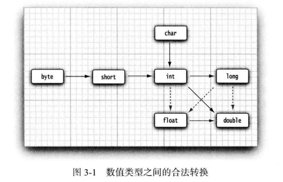
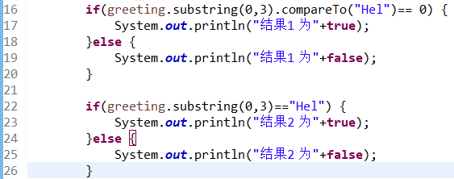
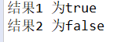
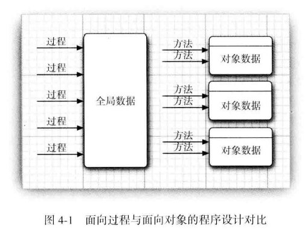
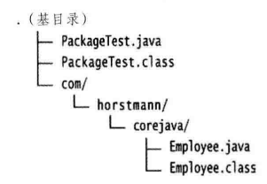
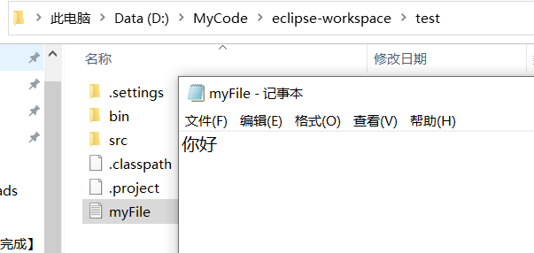
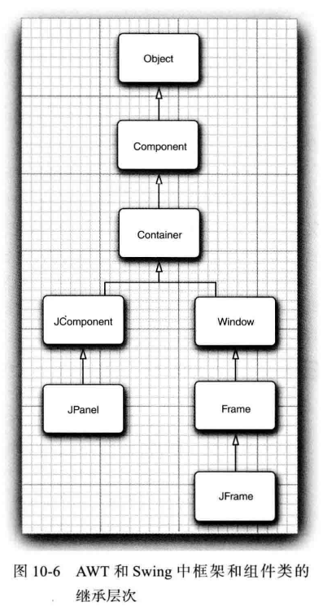
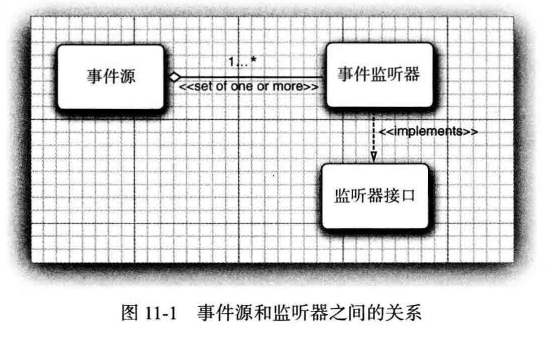

[TOC]

# Java 核心技术 卷1 第10版

## 1. Java 程序设计概述

- 简单性
- 面向对象
  - 与C++面向对象的特性相同
- 分布式
  - 有一个丰富的例程库，用于处理HTTP和FTP之类的TCP/IP协议
  - Java应用程序可以通过URL 打开和访问网络上的对象，快捷程序相当于访问本地文件一样
- 健壮性
- 安全性
  - Java适用于网络/分布式环境，可以构建防范病毒、防篡改的系统，例如：
    - 运行时堆栈溢出，如蠕虫和病毒常用的攻击手段
    - 破坏自己的进程空间之外的内存
    - 未经授权读写文件
- 体系结构中立
  - 只要有Java运行时系统，编译后的代码可以在许多处理器运行
  - 精心设计的字节码可以很容易地在任何机器上解释执行，还可以动态地翻译成本地机器代码
- 可移植性
  - Java规范中没有“依赖具体实现”的地方，基本数据类型的大小以及有关运算都做了明确的说明，例如：
    - Java中的 int 永远为32位的整数，但是C/C++，中int可能为16或32位整数
    - 唯一的限制是，short类型的大小 =< int类型的大小 =< long int类型的大小
    - 数据类型具有固定的大小，就消除代码移植时令人头疼的问题
    - 二进制数据以固定的格式进行存储和传输，消除了字节顺序的困扰
    - 字符串是用标准的 Unicode 格式存储 
- 解释型
  - Java解释器可以在任何移植了解释器的机器上执行Java字节码
- 高性能
  - 即时编译器可以监控经常执行哪些代码，并优化这些代码以提高速度
  - 更为复杂的优化是消除函数调用（即内联）
- 多线程
  - 多线程可以带来更好的交互响应和实时行为
  - Java是第一个支持并发程序设计的主流语言
  - 多核处理器
- 动态性
  - Java比C++更具有动态性
  - 库中可以自由地添加新方法和实例变量，对客户端没有任何影响
    - 例如：从Internet 下载代码，然后在浏览器上运行
- Java applet 与 Internet
  - 用户从Internet 下载 Java 字节码，在网上运行的Java程序称为applet

---


## 2. Java 程序设计环境

- 下载 JDK，Java开发工具包
- 设置 JDK
- 使用集成开发环境
  - Eclipse
  - Myeclipse
  - IntelliJ IDEA
  - Jbuilder
  - Jdeveloper
  - Netbeans
  - JCreator
- Java 的版本
  - Java SE 是 java 平台标准版
  - Java EE 是 java 平台企业版
  - Java ME 是 java 平台微机版，多用于开发手机移动端
- Java 开发
  - Java的源代码是*.java 的纯文本文件
  - JDK是Java的开发包，可以将*.java 文件编译成可执行Java程序
  - 可执行Java程序需要JVM才可以运行
  - JRE包含JVM
  - JDK包含JRE
- 常见DOS命令
  - cmd 弹出dos命令窗口
  - d: 切换到D盘
  - dir 显示当前所有文件夹
  - cd 文件夹名称，进入文件夹
  - cd.. 回退
  - cd Java视频 \\ \\ day 01，进入多级目录
  - cd\，多级回退
  - cls 清屏
  - exit 退出dos命令行
- Hello World 流程图
  - HelloWorld.java → HelloWorld.class → 0010100011...→  程序
  - ​        源文件         →        字节码文件    →         机器码      →  程序

---


## 3. Java 的基本程序设计结构

- 一个简单的Java应用程序

- 注释

  - 单行注释：//注释文字
  - 多行注释：/* 注释文字 */
  - 文档注释：/** 注释文字 **/

- 关键字

  - 全部小写
  - 有特殊颜色标记
  - 关键字分类
    - 定义数据类型：class, interface, byte, short, int, long, float, double, char, boolean, void
    - 定义数据类型值：true, false, null
    - 定义流程控制：if, else, switch, case, default, while, do, for, break, continue, return 
    - 定义访问权限修饰符：private, protected, public
    - 定义类、函数、变量修饰符：abstract, final, static, synchronized
    - 定义类与类之间关系：extends, implements
    - 定义建立实例及引用实例，判断实例：new, this, super, instanceof
    - 用于异常处理：try, catch, finally, throw, throws
    - 用于包：package, import
    - 其他修饰符关键字：native, strictfp, transient, volatile, assert

- 数据类型

- 常量

  - 其值不改变的
  - 字符串常量 “Hello”
  - 整数常量  12，-23
  - 小数常量  12.23
  - 字符常量  ‘a’
  - 布尔常量  true， false
  - 空常量  null

- 变量

  - 是内存中的一小块区域，程序执行过程中，其值在一定范围内变化

    - B是字节，bit是比特、位

    - 1B = 8 bit
    - 1KB=1024 B
    - 1MB =1024KB

  - 数据类型（单位，B）

    - 基本数据类型

      > 数值型：
      >
      > - 整数型：byte 1, short 2, int 4, long 8
      > - 浮点型：float 4, double 8
      > - 整数默认int，浮点数默认double
      > - 定义long类型，建议加L；定义float类型，建议加F
      >
      > 字符型：
      >
      > - char 2
      >
      > 布尔型：
      >
      > - boolean 1

    - 引用数据类型

      > 类：class
      >
      > 接口：inerface
      >
      > 数组：[ ]

  - 变量名

    - 标志符：给包、类、方法、变量起名的符号

    - Unicode 字符，数字、英文大小写、汉字，下划线_，美元符$

    - 数字不能开头，不能是Java中的关键字

    - 常见命名规则：

      >1. 包（其实就是文件夹，对相似的类进行管理）
      >   - 全部小写，多级包 . 隔开
      >   - 例如：com, com.itheima
      >2. 类
      >   - 一个单词首字母大写，如：Student，Car
      >   - 多个单词每个单词首字母大写，如：HelloWorld
      >3. 方法和变量
      >   - 一个单词首字母小写，如：age(), show()
      >   - 多个单词，从第二个单词的首字母大写，如：maxAge(), getAge()

  - 初始化值

    ```java
    public class VariableDemo{
        public static void main (String[] args){
            //定义byte
            byte b = 10;
            System.out.println(b);
            
            //定义short
            short s = 100;
            System.out.println(s);
            
            //定义int
            int i = 10000;
            System.out println(i);
            
            //定义long
            long l = 1000000000000L;
            System.out.println(l);
            
            //定义float
            float f = 12.34F;
            System.out.println(f);
            
            //定义double
            double d = 12.34;
            System.out.println(d);
            
            //定义char
            char c = 'a';
            System.out.println(c);
            
            //定义boolean
            boolean bl = true;
            System.out.println(bl);
        }
    }
    ```

    - 注意事项：
      1. 变量未赋值不能直接使用
      2. 变量只在所属范围内有效，变量属于它所在的代码块，{ }
      3. 一行可以定义多个变量，但是不建议

- 运算符

  - 类型转换：隐式转换、强制转换

    - 隐式转换：

      - byte, short, char → int → long → float → double，从小到大可以，如 byte 和 int，结果为 int
      - byte，short，char 之间不转换，他们参与运算首先转换为 int 

    - 强制转换

      - 目标类型 变量名 = （目标类型）（被转换的数据）

        ```
        int a = 10;
        byte b = 20;
        
        byte d = (byte)a + b;//原本d应该为int，利用强制类型转换
        ```

        

  - 

  - 使用算术运算法+ - * / ，默认整数，否则浮点数运算

  - 快捷键：

    - main，Alt + /
    - syso,    Alt + /

  - 运算符分类：

    > 1. 算数运算符：+，-，*，/（整数相除只有整数，要想得小数，必须有浮点数参与），%，++，--
    >    - ‘A’ 65   ‘a’  97  ‘0’  48
    > 2. 赋值运算符：+=，-= ,...
    >    - 扩展的赋值运算符，隐含强制类型转换
    > 3. 关系运算符：==，!=, <=, >=,...
    >    - 结果都是boolean类型，true , false
    > 4. 逻辑运算符：& |  ^  !    && ||
    >    -  &与&&的区别：&，左边无论真假，右边都进行运算；&&，左边为真，右边参与运算，左边为假，右边不参与运算
    >    -  ^ 异或，相同为false ，不同为true
    > 5. 三元运算符：关系表达式 ？ 表达式1 ： 表达式2
    >    - true，就返回   表达式1
    >    - false，就返回   表达式2

- 字符串

  - 子串 substring(0,3) //从0开始，取3个字符

    - s="" ; //为空字符串

  - 拼接 “S”+“M”

  - 不可变字符串

    - 字符“Hello”是不可变的，但是greeting是可以变的

    - ```java
      String greeting = "Hello World"
      greeting = greeting.substring(0,3)+"p!";
      ```

    - 字符串**不是**字符型数组，而**是**类似于 char* 指针，在堆区中不使用的内存将会自动进行垃圾回收

  - 检测字符串是否相等

    - s.equals(t); // s 与 t 是否相等，true，false、

    - 不能用C++的string类重载了==检测共享的字符串是否相等，系统会出错

    - 应该用 if(greeting.compareTo("Hello")== 0) 代替 if(greeting.substring(0,3) == "Hel")

      

      

  - 检测空串与Null串

    - 判断是否为空串，if(str.length() == 0) 或 if(str.equals(""))
    - 判断既不是null也不为空串，if(str != null && str.length() != 0 )

  - String API

    - StringBuilder(); //空的字符串构建器
    - int length();//返回构建器中的代码单元数量
    - StringBuilder append(String str);//追加字符串并返回 this
    - StringBuilder append(char c);//追加代码单元并返回 this
    - StringBuilder appendCodePoint(int cp);//追加代码点，并将其转换成一个或两个代码单元并返回 this
    - StringBuilder insert(int offset,String str);//在offset位置插入一个字符串并返回 this
    - StringBuilder delete(int startIndex, int endIndex);//删除偏移量从startIndex 到 endIndex的代码单元并返回this
    - String toString();//返回一个与构建器或缓冲区内容相同的字符串

- Eclipse的使用

  - 先建立项目，然后新建包，再新建类

- 输入输出

- 控制流

  - 顺序结构

  - 选择结构

    - Ctrl + Shift + o 导包快捷键方式

      ```java
      //导入键盘输入的包
      import java.util.Scanner ; 
      
      //创建对象
      Scanner sc = new Scanner(System.in); 
      
      //获取数据
      System.out.println(“请输入数据：”);
      int a = sc.nextInt(); 
      ```

    - if 语句
    - switch 语句（表达式可以是 byte，short，char，int）

  - 循环结构

    - for 必须入口判断成立才能进入循环
    - while 必须入口判断成立才能进入循环
    - do ... while 至少执行一次循环体
    - 跳转语句：
      - break 结束循环     
      - continue 结束一次循环，继续下一次循环

- 大数值

- 数组

  ```java
  //导包
  import java.util.Random;
  
  //创建对象
  Random r = new Random();
  
  //获取随机数
  int num = r.nextInt(10); //获取[0,10)，含0，不含10的随机数
  int num = r.nextInt(10)+1; //获取含1-10的随机数
  ```

<<<<<<< HEAD
<<<<<<< HEAD
  
=======
<<<<<<< HEAD
  
=======
<<<<<<< HEAD
  
=======
<<<<<<< HEAD
  
=======
=======
>>>>>>> 14bc474 (2021/1/27)
  - 数组定义格式：int [ ]  arr ; //推荐

  - 数组长度：arr.length; 二维数组.length;//表示二维数组的行

  - 数组初始化：

    - 动态初始化：int [ ] arr = new int [3];//开辟长度为3的数组 

    - 静态初始化：int [ ] arr = new int [ ] {1, 2, 3, 4, 5};

      ​    简化格式： int [ ] arr = {1, 2, 3, 4, 5};

  - Java中的内存分配，Java在运行时对空间的不同区域进行了划分，每块区域都有特点的处理数据方式和内存管理方式，如下：

    - 栈：存储局部变量（定义在方法中的变量），使用完毕立即回收
    - 堆：存储new出来的东西（实体、对象），每个对象都有地址值，每个对象都有默认值，使用完毕后会在垃圾回收器空闲的时候被回收；byte，short，int，long，0；float，double，0.0；char，'\u0000'；boolean，false。
    - 方法区：面向对象
    - 本地方法区：和系统相关
    - 寄存器：给CPU使用

  - 数组操作中的两个常见问题

    - 数组索引越界
      - ArrayIndexOutOfBoundsException
      - 访问到数组中的不存在的索引时发生
    - 空指针异常
      - NullPointerException
      - 数组引用没有指向对象，却在操作对象中的元素 
<<<<<<< HEAD
>>>>>>> 09b4aa0 (2021/1/22 JavaNotes)
>>>>>>> 3fda1a3 (20211/1/22)
>>>>>>> 6295977 (2021/1/22)
>>>>>>> fc2b77d (2021/1/22)
=======
>>>>>>> 14bc474 (2021/1/27)

---


## 4. 对象与类

<<<<<<< HEAD
<<<<<<< HEAD
=======
<<<<<<< HEAD
=======
<<<<<<< HEAD
=======
<<<<<<< HEAD
>>>>>>> 3fda1a3 (20211/1/22)
>>>>>>> 6295977 (2021/1/22)
>>>>>>> fc2b77d (2021/1/22)


---


## 5. 继承


<<<<<<< HEAD
=======
<<<<<<< HEAD
=======
<<<<<<< HEAD
=======
=======
=======
>>>>>>> 14bc474 (2021/1/27)
- 面向对象程序设计概述

  - 面向对象程序设计 OOP

  - 算法+数据结构=程序

    

  - 类 class 是构造对象的模板，由类构造（construct）对象的过程称为创建类的实例（instance）

  - 封装（encapsulation，数据隐藏），封装将数据和行为组合在一个包中，并对对象的使用者隐藏了数据实现的方式

    - 对象中的数据称为实例域，instance field
    - 操作数据的过程称为方法，method
    - 对于每个特定的类实例（对象）都有一组特定的实例域值，这些值的集合就是这个对象当前的状态state
    - 实现封装的关键就是绝对不能让类中的方法直接访问其他类的实例域

  - 对象

    - 对象的行为 behavior，行为相同，具有家族式的相似性，用可调用的方法定义的
    - 对象的状态 state，存在差异
    - 对象标识 identity，永远不同

  - 类之间的关系

    - 依赖 uses-a，A类的方法操纵B类的对象，就说A类依赖于B类
    - 聚合 has-a，A类的对象包含B类的对象
    - 继承 is-a，AA类由A类继承而来，在特殊性的AA类中又包含看一些用于优先处理的特殊方法。

- 使用预定义类

  - 对象与对象变量

    - 先使用构造器（constructor）构造新例，指定其初始状态，如何对对象应用方法。

      > 构造器的名字应该与类名相同，new Data();

    - LocalDate类

  - 更改器方法与访问器方法

    - static LocalTime now();//构造一个表示当前日期的对象
    - static LocalTime of(int year, int month, int day);//构造一个给定日期的对象
    - int getYear();//得到当前日期的年
    - int getMonthValue();//得到当前日期的月
    - int getDayofMonth();//得到当前日期的日

- 用户自定义类

  - private 确保只有Employee类自身的方法能够访问这些实例域，其他类的方法不能够读写这些域。

  - 构造器的特点

    - 与类同名

    - 每个类可以有一个以上的构造器

    - 构造器可以有0个、1个或多个参数

    - 构造器没有返回值

    - 构造器总是伴随着new操作一起调用，这与C++不同

      ```
      // C++，Not Java
      Employee number001("James Bond",10000,1950,1,1);
      
      // Java
      new Employee("James Bond",10000,1950,1,1);
      ```

  - 基于类的访问权限

  - 私有方法

  - final 实例域，final 修饰大豆应用于基本类型域primitive或不可变immutable类的域

- 静态域与静态方法

  - 静态域 static
<<<<<<< HEAD
=======

    >- 静态方法和静态对象可以调用，不能调用非静态的对象和方法
    >- static 的优点：1. 对对象的共享数据提供单独空间的存储，节省空间，没有必要为每一个对象都存储一份；2. 可以直接被类名调用，不用在堆内存创建对象。
    >- static 的弊端：1.访问出现局限性，静态虽好，只能访问静态成员。
    >
    >

>>>>>>> 14bc474 (2021/1/27)
  - 静态方法，是没有this参数的，静态方法是不能向对象实施操作的方法，没有隐式的参数。

- 方法参数

  - 按值调用，方法得到的是所有参数值的一个拷贝，对对象参数的修改保留下来

  - 一个方法不能修改一个基本数据类型的参数（数值型或者布尔型）

  - 一个方法可以改变一个对象参数的状态

  - 一个方法不能让对象参数引用一个新的对象

    ```java
    // sum方法的构造
    public static int sum(int a, int b){
        int c = a + b;
        return c;
    }
    ```

  - void 修饰的方法只能单独调用，例如 

    ```java
    printHelloWorld(); // 正确
    void v = printHelloWorld(); // 错误
    ```

  - 方法的参数如果是基本数据类型，那么形式参数的改变不允许实际参数的改变

  - 形参：用于接受实际参数的变量

  - 实参：实际参与运算的变量

  - 如果参数是引用数据类型，例如 arr[] 指向堆区的数组的地址

<<<<<<< HEAD
=======
  - 局部代码块（存在于方法中，控制变量的生命周期（作用域））

  - 构造代码块（提取构造方法中的共性，每次创建对象都会执行，并且在构造方法执行前执行）

  - 静态代码块（随着类的加载而加载，只加载一次）

>>>>>>> 14bc474 (2021/1/27)
- 对象构造

  - 重载：如果多个方法有相同的名字、不同的参数，便产生了重载。

    - 方法名相同，参数列表不同（参数个数不同，参数类型不同），与返回值无关

    - Java虚拟机会通过参数列表的不同来区分同名的方法

    - ```java
      public static int sum(int a, int b, int c){
          return a+b+c;
      }
      public static int sum(int a, int b){
          return a+b;
      }
      ```

  - Java有自动的垃圾回收器，所以不需要对象析构

- 包 package

  - 包中存放着许多Java类
<<<<<<< HEAD
  - 
  - 
=======

  - 

  - s.setName(String);

  - s.getName( );

  - this

    ```java
    public void setName(String name){
        this.name = name;
    }
    
    public String getName(){
        return name;
    }
    
    public void setAge(int age){
        this.age = age;
    }
    
    public int getAge(){
        return age;
    }
    ```

    
>>>>>>> 14bc474 (2021/1/27)

- 类路径

- 文档注释

- 类设计技巧

- 其他

  - case 不加 break 会穿透到下一个case

---


## 5. 继承

- 类、超类和子类
<<<<<<< HEAD
- Object：所有类的超类
- 泛型数组列表
- 对象包装器与自动装箱
- 参数数量可变的方法
- 枚举类
- 反射
- 继承的设计技巧
>>>>>>> 09b4aa0 (2021/1/22 JavaNotes)
>>>>>>> 3fda1a3 (20211/1/22)
>>>>>>> 6295977 (2021/1/22)
>>>>>>> fc2b77d (2021/1/22)
=======

  - 继承：多个类由共同的成员变量和方法，让多个类继承一个父类

  - ```
    public LOL ExtendsDemo{
         ...
    }
    ```

  - 继承的特点：

    - Java只支持单继承，不支持多继承
    - 一个类只能有一个父类，不可以有多个父类
    - class SubDemo extends Demo{} //ok
    - class SubDemo extends Demo1,Demo2{} // error!
    - Java支持多层继承，继承体系
    - class A{}
    - class B extends A{}
    - class C extends B{}

  - 子类只能继承父类的非私有成员，就近原则，super.name父类的name，this.name

  - 方法的重写 vs 方法的重载

    - 重载：一个类中有多个重名的方法，但是其参数不一样，参数的个数、类型、顺序
    - 重写：在子父类中，方法完全一样，子类重写了父类的方法（覆盖），只能调用子类的方法，要用父类的方法需要super

  - abstract：关键字，用于修饰方法和类

    - 抽象方法：不同类的方法是相似的，但是具体内容不一样，我们只能抽取他的声明，没有具体方法的方法就是抽象方法。
    - 一个类继承了它的抽象类，需要重写它所有的抽象方法。，否则这个类只能为抽象类。
    - 抽象方法只能在抽象类里，abstract
    - abstract不能与final和private共存，抽象类有构造函数，可以没有抽象方法

- Object：所有类的超类

- 泛型数组列表

- 对象包装器与自动装箱

- 参数数量可变的方法

- 枚举类

- 反射

- 继承的设计技巧

  - 继承是多态的前提
  - 缺点：高耦合性，开发的原则是高内聚和低耦合；
>>>>>>> 14bc474 (2021/1/27)

---


## 6. 接口

<<<<<<< HEAD


=======
- 接口
  
  - 接口（interface）是一个比抽象类更抽象的类，接口里所有的方法都是抽象方法，接口和类的关系是实现，implements
  
  - 格式：
  
    ​                interface 接口名{
  
    ​                 } 
  
  - 类与类：继承关系，单一继承，多层继承；
  
  - 类与接口：实现关系，多实现
  
  - 接口与接口：继承关系，多继承
  
  - List接口：有序，可以重复；Set接口：无序，不能重复；
  
  - 降低程序的耦合性，可以实现模块的开发。
  
  - 接口只有常量，只能有抽象方法，方法默认public abstract，没有构造方法
  
  - API (Application Programming Interface)，应用程序编程接口
  - Java API 就是 JDK中提供的各种功能的Java类
  - String 类
    - 字符串的内容是存储在方法区的常量池里的，为了方便字符串的重复使用
    - 
  
- 接口示例

- I/O流：读数据（输入流）FileWriter，写数据（输出流）

  ```java
  package com.wuwenwen07;
  
  import java.io.FileWriter;
  import java.io.IOException;
  
  public class FileWriteTest01 {
  	public static void main(String[] args) throws IOException {
  		//创建输出流对象
  		FileWriter fw = new FileWriter(".\\myFile.txt");//或者直接myFile.txt
  		fw.write("你好");
          fw.flush();//刷新
  	}
  }
  //文件myFile在工作台
  ```

  

  

  ```java
  package com.wuwenwen07;
  
  
  import java.io.FileReader;
  import java.io.IOException;
  
  public class FileReaderTest03 {
  	public static void main(String[] args) throws IOException {
  		FileReader fr = new FileReader("fr.txt");
  		
  		//防止中文乱码
  		//*.txt 的格式是ANSI
  		
  		// 一次读写一个字符数组
  		char[] chs = new char[1024];
  		int len; // 用于存储读到的字符个数
  		while((len=fr.read(chs))!=-1) {
  			System.out.println("len = "+len);
  			System.out.print(new String(chs,0,len));
  			
  		}
  	}
  }
  
  ```

  - 缓存流

  ```java
  package com.wuwenwen07;
  
  import java.io.BufferedWriter;
  import java.io.FileWriter;
  import java.io.IOException;
  
  public class BufferedWriterTest01 {
  	public static void main(String[] args) throws IOException {
  		//创建缓冲流
  		BufferedWriter bw = new BufferedWriter(new FileWriter("bw.txt"));
  		
  		bw.write("love you!");
  		
  		bw.flush();
  		
  		bw.close();
  	}
  }
  
  ```

  ```java
  package com.wuwenwen07;
  
  import java.io.BufferedReader;
  import java.io.FileReader;
  import java.io.IOException;
  
  public class BufferedWriterTest01 {
  	public static void main(String[] args) throws IOException {
  		//创建缓冲流
  		/*BufferedWriter bw = new BufferedWriter(new FileWriter("bw.txt"));
  		
  		bw.write("love you!");
  		
  		bw.flush();
  		
  		bw.close();*/
  		
  		BufferedReader br = new BufferedReader(new FileReader("Copy.java"));
  
  		int ch;
  		while((ch=br.read())!=-1) {
  			System.out.print((char)ch);
  		}
  		
  		//释放资源
  		br.close();
  
  	}
  }
  
  ```

  ```java
  package com.wuwenwen07;
  
  import java.io.BufferedReader;
  import java.io.FileReader;
  import java.io.IOException;
  
  public class BufferedWriterTest01 {
  	public static void main(String[] args) throws IOException {
  		//创建缓冲流
  		/*BufferedWriter bw = new BufferedWriter(new FileWriter("bw.txt"));
  		
  		bw.write("love you!");
  		
  		bw.flush();
  		
  		bw.close();*/
  		
  		BufferedReader br = new BufferedReader(new FileReader("Copy.java"));
  
  		/*int ch;
  		while((ch=br.read())!=-1) {
  			System.out.print((char)ch);
  		}*/
  		
  		char[] ch = new char[1024];
  		int len;
  		while((len=br.read(ch))!=-1) {
  //			System.out.println("len = "+len);
  			System.out.println(new String(ch,0,len));
  		}
  		
  		//释放资源
  		br.close();
  
  	}
  }
  
  ```

  高效读写数据——FileBufferedWriter、FileBufferedReader

- lambda 表达式

- 内部类

- 代理

- 匿名对象

  - 匿名对象只能调用一次，匿名对象赋值没有意义

- final ：修饰符，可以修饰类、成员方法和成员变量

  - final 修饰的类不能被继承，不能有子类
  - final修饰的方法不能被重写，修饰的变量是常量，不能被修改，大写

- 多态

  - 子父类的继承关系，方法的重写，父类引用指向子类对象

  - 多态的成员特点：成员变量：编译时看的是左边，运行时也是左边

    ​                                成员方法：编译时看的是左边，运行时是右边

    ​                                静态方法：编译时是左边，运行时也是左边

- 正则表达式：一套规则，用以匹配指定字符串

  ```java
  boolean flag = qq.matches("[1-9][0-9]{4,14}");
  ```

- 多态

  ```java
  Collection c = new ArrayList();//多态，父类引用指向子类对象
  ```

  
>>>>>>> 14bc474 (2021/1/27)

----


## 7. 异常、断言和日志

<<<<<<< HEAD


---


## 8. 泛型程序设计


=======
- 处理错误

  - 异常分类

    

  - 异常：代码编译或运行时出错

  - 编译时异常：RuntimeException的子类就是运行时期异常

  - 运行时异常：Exception的子类，编译时必须处理

  - Error：出现的不能够处理的严重问题

  - Exception：可以处理的问题

- 捕获异常

  - 捕获处理：try...catch语句

  - 抛出去：throws IOException，虚拟机处理

    - throws 是处理异常的一种方式，把异常抛出，让处理机处理

    - throw 是制造异常的方式

      ```java
      throw new RuntimeException("要求不符合类型！");
      ```

- 使用异常机制的技巧

  - 定义一个自己的异常类：写一个类去继承Exception或者RuntimeException，然后实现多个构造即可。

    ```java
    public class MyException extends RuntimeException{
        public MyException(){
            super();
        }
        public MyException(String message){
            super(message);
        }
    }
    
    public static void checkScore(int score){
        if(score<0||score>100){
            throw new MyException("考试成绩不合法！");
        }
        System.out.println("考试成绩符合要求")
    }
    ```

    

- 使用断言

- 记录日志

- 调试技巧

---


## 8. 泛型程序设计

- 为什么要使用泛型程序设计
- 定义简单泛型类
  - Java的泛型类似于C++的模板类，但是没有专用的template关键字
- 泛型方法
- 类型变量的限定
- 泛型代码和虚拟机
- 约束与局限性
- 泛型类型的继承规则
- 通配符类型
- 反射和泛型
>>>>>>> 14bc474 (2021/1/27)

---


## 9. 集合

<<<<<<< HEAD


=======
- Java集合框架

  - 常见的类由Vector,Stack,Hashtable,BitSet等
  - ArrayList<String> arr = new ArrayList<String>();

- 具体的集合

- 映射

  - Map的两种遍历方式：

    ```java
    //第一种遍历方式
    public class MapDemo{
        public static void main(String[] args){
            //创建Map对象
            Map<String,String> map = new HashMap<String,String>();
            //添加映射关系
            map.put("A","1");
            map.put("B","2");
            map.put("C","3");
            //遍历Map对象
            Set<String> keys = map.keySet();
            for(String key:keys){
                String value = map.get(key);
                System.out.println("key="+key+"value="+value);
            }
      		     
        }
    }
    ```

    ```java
    //第二种遍历方式
    public class MapDemo{
        public static void main(String[] args){
            //创建Map对象
            Map<String,String> map = new HashMap<String,String>();
            //添加映射关系
            map.put("A","1");
            map.put("B","2");
            map.put("C","3");
            //遍历Map对象
            Set<Map.Entry<String,String>> entrys = map.entrySet();
            for(Map.Entry<String,String> entry:entrys){
                String key = entry.getKey();
                String value = entry.getValue();
                
                System.out.println("key="+key+"value="+value);
            }
      		     
        }
    }
    ```

    

- 视图与包装器

- 算法

- 遗留的集合
>>>>>>> 14bc474 (2021/1/27)

----


## 10. 图形程序设计

<<<<<<< HEAD


=======
- Swing 概述

  - Swing是基于AWT架构之上的，指的是被绘制的用户界面类。

    

    

- 创建框架

- 框架定位

- 在组件中显示信息

- 处理2D图形

- 使用颜色

- 文本使用特殊字体

- 显示图像
>>>>>>> 14bc474 (2021/1/27)

---


## 11. 事件处理

<<<<<<< HEAD


=======
- 事件处理基础

  

  

- 动作

- 鼠标事件

- AWT事件继承层次
>>>>>>> 14bc474 (2021/1/27)

---


## 12. Swing 用户界面组件


----


## 13. 部署 Java 应用程序


----


## 14. 并发


---


