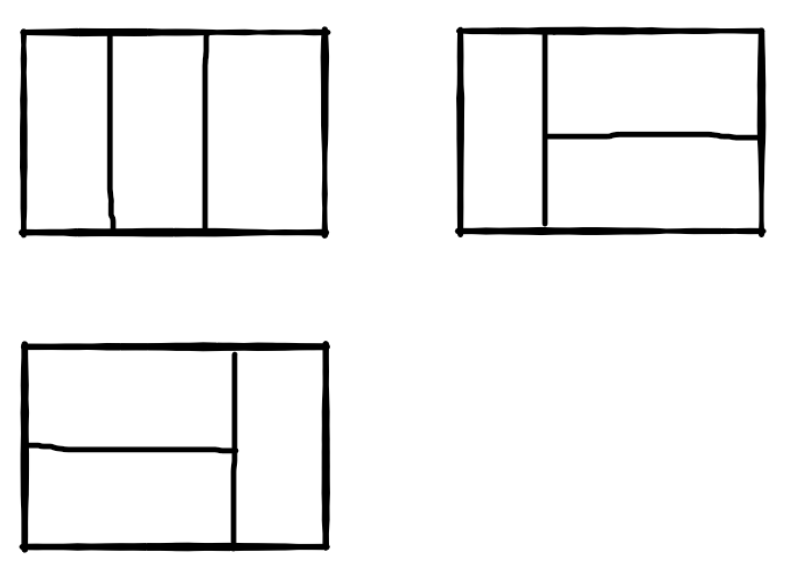

[TOC]

# 剑指offer-Java

## 数组中重复的数字

```java
class Solution {
    public int findRepeatNumber(int[] nums) {
        Set<Integer> set = new HashSet<Integer>();
        int repeat = -1;
        for (int num : nums) {
            if (!set.add(num)) {
                repeat = num;
                break;
            }
        }
        return repeat;
    }
}


```


## 二维数组的查找

题目描述

在一个二维数组中（每个一维数组的长度相同），每一行都按照从左到右递增的顺序排序，每一列都按照从上到下递增的顺序排序。请完成一个函数，输入这样的一个二维数组和一个整数，判断数组中是否含有该整数。

```java
public class Solution {
    public boolean Find(int target, int [][] array) {
        if(array==null){
            return false;
        }
        int  column = array[0].length-1;
        int row = 0;
        while(row<array.length && column>=0){
            if(array[row][column]==target){
                return true;
            }
            if(array[row][column]>target){
                column--;
            }else{
                row++;
            }
            
        }
        return false;
    }
}
```

```java
class Solution {
    public boolean findNumberIn2DArray(int[][] matrix, int target) {
        if(matrix==null || matrix.length==0 || matrix[0].length==0){
            return false;
        }
        int col=matrix[0].length-1;
        int row=0;
        while(row<matrix.length && col>=0){
            if(matrix[row][col]==target){
                return true;
            }
            if(matrix[row][col]>target){
                col--;
            }else{
                row++;
            }
        }
        return false;
    }
}
```


## 替换空格

题目描述
请实现一个函数，将一个字符串中的每个空格替换成“%20”。例如，当字符串为We Are Happy.则经过替换之后的字符串为We%20Are%20Happy。

```java

public class Solution {
    public String replaceSpace(StringBuffer str) {
    	if(str == null)
            return null;
        StringBuffer output = new StringBuffer();
        for(int i=0;i<str.length();i++){
            char c = str.charAt(i);
            if(c==' '){
                output.append("%20");
            }else{
                output.append(c);
            }
            
        }
        return output.toString();
  }
}
```

## 从尾到头打印链表

题目描述
输入一个链表，按链表从尾到头的顺序返回一个ArrayList。

```java
/**
*    public class ListNode {
*        int val;
*        ListNode next = null;
*
*        ListNode(int val) {
*            this.val = val;
*        }
*    }
*
*/
import java.util.*;
import java.util.ArrayList;
public class Solution {
    public ArrayList<Integer> printListFromTailToHead(ListNode listNode) {
        ArrayList<Integer> list = new ArrayList<>();
        ListNode tmp = listNode;
        while(tmp!=null){
            list.add(0,tmp.val);
            tmp=tmp.next;
        }
        return list;
    }
}
//时间和空间复制度 O（n）
```

```java
/**
*    public class ListNode {
*        int val;
*        ListNode next = null;
*
*        ListNode(int val) {
*            this.val = val;
*        }
*    }
*
*/
import java.util.*;
import java.util.ArrayList;
public class Solution {
    ArrayList<Integer> list = new ArrayList<>();
    public ArrayList<Integer> printListFromTailToHead(ListNode listNode) {
        
        if(listNode!=null){
            printListFromTailToHead(listNode.next);
            list.add(listNode.val);
        }
        return list;
    }
}
```

## 重建二叉树

题目描述
输入某二叉树的前序遍历和中序遍历的结果，请重建出该二叉树。假设输入的前序遍历和中序遍历的结果中都不含重复的数字。例如输入前序遍历序列{1,2,4,7,3,5,6,8}和中序遍历序列{4,7,2,1,5,3,8,6}，则重建二叉树并返回。

```java
/**
 * Definition for binary tree
 * public class TreeNode {
 *     int val;
 *     TreeNode left;
 *     TreeNode right;
 *     TreeNode(int x) { val = x; }
 * }
 */
//递归构造，时间空间 O(n)
import java.util.*;
public class Solution {
    public TreeNode reConstructBinaryTree(int [] pre,int [] in) {
        if(pre.length==0||in.length==0){
            return null;
        }
        TreeNode root = new TreeNode(pre[0]);
        //在中序中找到前序的根
        for(int i=0;i<in.length;i++){
            if(in[i]==pre[0]){
                //左子树，copyOfRange 函数 左闭右开
                root.left = reConstructBinaryTree(Arrays.copyOfRange(pre,1,i+1),Arrays.copyOfRange(in,0,i));
                root.right = reConstructBinaryTree(Arrays.copyOfRange(pre,i+1,pre.length),Arrays.copyOfRange(in,i+1,in.length));
                break;
            }
        }
        return root;
    }
}
```

## 用两个栈实现队列

题目描述
用两个栈来实现一个队列，完成队列的Push和Pop操作。 队列中的元素为int类型。

```java
import java.util.Stack;
import java.util.*;
public class Solution {
    Stack<Integer> stack1 = new Stack<Integer>();
    Stack<Integer> stack2 = new Stack<Integer>();
    
    public void push(int node) {
        stack1.push(node);
    }
    
    public int pop() {
        if(stack2.size()<=0){
            while(stack1.size()!=0){
                stack2.push(stack1.pop());
            }
        }
        return stack2.pop();
    }
}
```

## 旋转数组的最小数字

题目描述

把一个数组最开始的若干个元素搬到数组的末尾，我们称之为数组的旋转。
输入一个非递减排序的数组的一个旋转，输出旋转数组的最小元素。
NOTE：给出的所有元素都大于0，若数组大小为0，请返回0。

```java
import java.util.ArrayList;
public class Solution {
    public int minNumberInRotateArray(int [] array) {
        //以右边为基准点，开始二分查找
        int start = 0, end = array.length-1,mid;
        while(start<end){
            //已经找到包含最小值的非递减区间
            if(array[start]<array[end]){
                return array[start];
            }
            mid = (start+end)/2;
            //右边大，舍弃右边的
            if(array[end]>array[mid]){
                end = mid;
            //右边小，舍弃左边的
            }else if(array[end]<array[mid]){
                start = mid+1;
            }else{
                end--;
            }
            
        }
        
        //存在为0处理
        return start == end?array[start]:0;
    }
}
```

## 斐波那契数列

题目描述
大家都知道斐波那契数列，现在要求输入一个整数n，请你输出斐波那契数列的第n项（从0开始，第0项为0，第1项是1）。
n\leq 39n≤39

```java
class Solution {
public:
    int Fibonacci(int n) {
        if(n==0){
            return 0;
        }else if(n==1){
            return 1;
        }
        int sum = 1;
        int one = 0;
        for(int i=2;i<=n;i++){
            sum = sum+one;
            one = sum-one;
        }
        return sum;
    }
};
//时间O(n),空间O(1)
```

## 跳台阶

## 题目描述

一只青蛙一次可以跳上1级台阶，也可以跳上2级。求该青蛙跳上一个n级的台阶总共有多少种跳法（先后次序不同算不同的结果）。

```java
class Solution {
public:
    int jumpFloor(int number) {
        if(number<=0){
            return 0;
        }else if(number==1){
            return 1;
        }else if(number==2){
            return 2;
        }else
            return jumpFloor(number-1)+jumpFloor(number-2);
    }
};
```

## 变态跳台阶

题目描述
一只青蛙一次可以跳上1级台阶，也可以跳上2级……它也可以跳上n级。求该青蛙跳上一个n级的台阶总共有多少种跳法。

```java
class Solution {
public:
    int jumpFloorII(int number) {
        if(number==0){
            return 0;
        }else if(number==1){
            return 1;
        }else
            return 2*jumpFloorII(number-1);
    }
};
```

## 矩形覆盖

题目描述
我们可以用2*1的小矩形横着或者竖着去覆盖更大的矩形。请问用n个2*1的小矩形无重叠地覆盖一个2*n的大矩形，总共有多少种方法？

比如n=3时，2*3的矩形块有3种覆盖方法：



```java
class Solution {
public:
    int rectCover(int number) {
        if(number<=2){
            return number;
        }else{
            return rectCover(number-1)+rectCover(number-2);
        }
    }
};
```

## 二进制中的1个数

题目描述
输入一个整数，输出该数32位二进制表示中1的个数。其中负数用补码表示。

```java
class Solution {
public:
     int  NumberOf1(int n) {
         int cnt = 0;
         while(n!=0){
             cnt++;
             n=n&(n-1);
         }
         return cnt;
     }
};
```

>如果一个整数不为0，那么这个整数至少有一位是1。如果我们把这个整数减1，那么原来处在整数最右边的1就会变为0，原来在1后面的所有的0都会变成1(如果最右边的1后面还有0的话)。其余所有位将不会受到影响。
>举个例子：一个二进制数1100，从右边数起第三位是处于最右边的一个1。减去1后，第三位变成0，它后面的两位0变成了1，而前面的1保持不变，因此得到的结果是1011.我们发现减1的结果是把最右边的一个1开始的所有位都取反了。这个时候如果我们再把原来的整数和减去1之后的结果做与运算，从原来整数最右边一个1那一位开始所有位都会变成0。如1100&1011=1000.也就是说，把一个整数减去1，再和原整数做与运算，会把该整数最右边一个1变成0.那么一个整数的二进制有多少个1，就可以进行多少次这样的操作。

## 数值的整数次方

题目描述
给定一个double类型的浮点数base和int类型的整数exponent。求base的exponent次方。

保证base和exponent不同时为0

```java
class Solution {
public:
    double Power(double base, int exponent) {
        if(base == 0.0)
            return 0.0;
        
        double res = 1.0d;
        int e = exponent>0?exponent:-exponent;
        for(int i=1;i<=e;i++){
            res *= base;
        }
        return exponent>0?res:1/res;
    }
};
```

## 调整数组顺序使得奇数位于偶数前面

题目描述
输入一个整数数组，实现一个函数来调整该数组中数字的顺序，使得所有的奇数位于数组的前半部分，所有的偶数位于数组的后半部分，并保证奇数和奇数，偶数和偶数之间的相对位置不变。

```java
import java.util.*;
public class Solution {
    public void reOrderArray(int [] array) {
        ArrayList<Integer> even = new ArrayList<>();
        int cnt = 0;
        for(int i=0;i<array.length;i++){
            if(array[i]%2==1){
                array[cnt]=array[i];
                cnt++;
            }else{
                even.add(array[i]);
            }
        }
        
        for(int i=0;i<even.size();i++){
            array[cnt] = even.get(i);
            cnt++;
        }
    }
}
```

## 链表中倒数第k个结点

题目描述
输入一个链表，输出该链表中倒数第k个结点。

```java
/*
public class ListNode {
    int val;
    ListNode next = null;

    ListNode(int val) {
        this.val = val;
    }
}*/
public class Solution {
    public ListNode FindKthToTail(ListNode head,int k) {
        if(head==null || k==0){
            return null;
        }
        
        ListNode slow = head;
        ListNode fast = head;
        for(int i=0;i<k;i++){
            if(fast==null){
                return null;
            }
            fast = fast.next;
        }
        while(fast!=null){
            slow = slow.next;
            fast=fast.next;
        }
        return slow;
    }
}
```

## 反转链表

```java
/*
public class ListNode {
    int val;
    ListNode next = null;

    ListNode(int val) {
        this.val = val;
    }
}*/
public class Solution {
    public ListNode ReverseList(ListNode head) {
        if(head == null||head.next ==null)
            return head;
        ListNode pre=null;
        ListNode next=null;
        while(head!=null){
            next = head.next;
            head.next = pre;
            pre=head;
            head=next;
        }
        return pre;
    }
}
```

## 合并两个排序的链表

```java
/*
public class ListNode {
    int val;
    ListNode next = null;

    ListNode(int val) {
        this.val = val;
    }
}*/
public class Solution {
    public ListNode Merge(ListNode list1,ListNode list2) {
        ListNode p=new ListNode(-1);
        ListNode cur = p;
        while(list1 !=null && list2!=null){
            if(list1.val<=list2.val){
                cur.next=list1;
                list1=list1.next;
            }else{
                cur.next = list2;
                list2=list2.next;
            }
            cur = cur.next;
        }
        if(list1!=null) cur.next=list1;
        if(list2!=null) cur.next=list2;
        return p.next;
    }
}
```

## 树的子结构

```java
/**
public class TreeNode {
    int val = 0;
    TreeNode left = null;
    TreeNode right = null;

    public TreeNode(int val) {
        this.val = val;

    }

}
*/
public class Solution {
    public boolean HasSubtree(TreeNode root1,TreeNode root2) {
        if(root1 == null || root2==null) return false;
        return isSame(root1,root2)||isSame(root1.left,root2)||isSame(root1.right,root2);
    }
    public boolean isSame(TreeNode root1,TreeNode root2){
        if(root2 == null) return true;
        if(root1 ==null) return false;
        return root1.val == root2.val && isSame(root1.left,root2.left) && isSame(root1.right,root2.right);
    }
    
}
```

## 二叉树的镜像

```java
/**
public class TreeNode {
    int val = 0;
    TreeNode left = null;
    TreeNode right = null;

    public TreeNode(int val) {
        this.val = val;

    }

}
*/
public class Solution {
    public void Mirror(TreeNode root) {
        if(root == null){
            return;
        }
        TreeNode tmp=root.left;
        root.left = root.right;
        root.right = tmp;
        Mirror(root.left);
        Mirror(root.right);
    }
}
```

## 顺时针打印矩阵

```java
import java.util.ArrayList;
public class Solution {
    public ArrayList<Integer> printMatrix(int [][] matrix) {
       ArrayList<Integer>list = new ArrayList<>();
        if(matrix==null || matrix.length==0 || matrix[0].length==0){
            return list;
        }
        int up=0;
        int down = matrix.length-1;//行
        int left = 0;
        int right = matrix[0].length-1;//列
        while(true){
            //最上面
            for(int col=left;col<=right;col++){
                list.add(matrix[up][col]);
            }
            //向下逼近
            up++;
            //判断是否越界
            if(up>down){
                break;
            }
            //最右边一行
            for(int row=up;row<=down;row++){
                list.add(matrix[row][right]);
            }
            right--;
            if(left>right){
                break;
            }
            for(int col=right;col>=left;col--){
                list.add(matrix[down][col]);
            }
            down--;
            if(up>down){
                break;
            }
            for(int row=down;row>=up;row--){
                list.add(matrix[row][left]);
            }
            left++;
            if(left>right){
                break;
            }
        }
        return list;
    }
}
```

## 包含min函数的栈

```java
/*
一个用来存所有的元素“stackTotal”,另一个用来存加入新的元素后当前stackTotal中对应的最小值。
两个栈中的元素数量始终保持一致，当新的元素小于“stackLittle”栈顶元素时，“stackLittle”像栈顶push新来的元素，否则，“stackLittle”向栈顶加入原栈顶元素。
执行“pop”方法时，两个栈同时弹出各自的栈顶元素。
*/
import java.util.Stack;

public class Solution {
    Stack<Integer> stack1 = new Stack<Integer>();
    Stack<Integer> stack2 = new Stack<Integer>();
    
    public void push(int node) {
        stack1.push(node);
        if(stack2.empty()){
            stack2.push(node);
        }else{
            if(node<=stack2.peek()){
                stack2.push(node);
            }else{
                stack2.push(stack2.peek());
                //peek()函数返回栈顶的元素，但不弹出该栈顶元素
            }
        }
    }
    
    public void pop() {
        stack1.pop();
        stack2.pop();
    }
    
    public int top() {
        return stack1.peek();
    }
    
    public int min() {
        return stack2.peek();
    }
}
```


