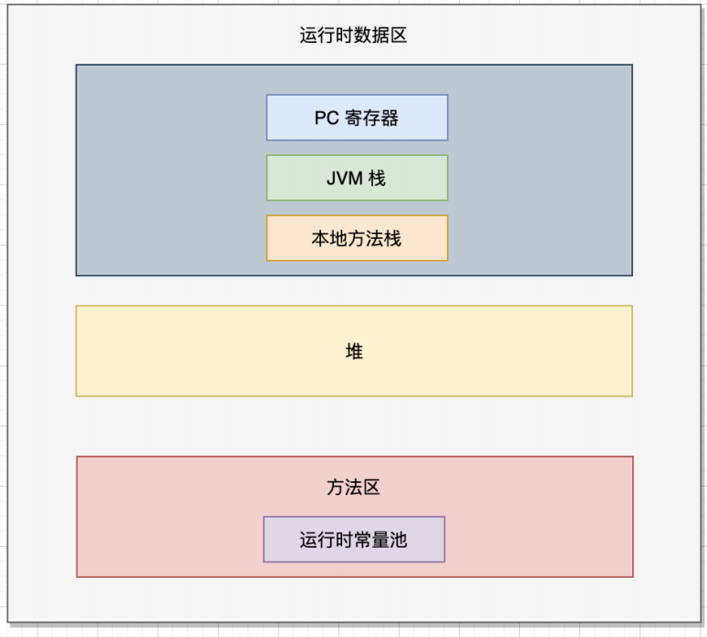
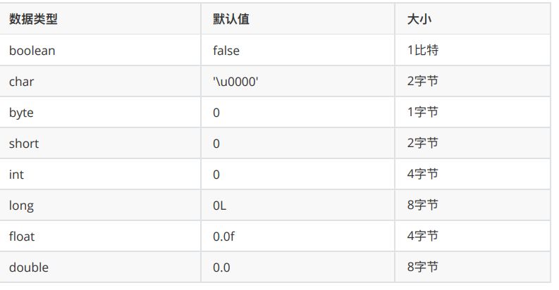

[TOC]

# 一、基础知识

#### 1. Java具有的特性

- 简单性

- 可移植性

  > 解决Java直接编译成的二进制码，在Windows系统可以运行，但是可能无法在Linux运行，为此Java先生成字节码，再JVM（Java虚拟机）来解释执行，将字节码转成不同操作系统可以识别的二进制码。
  
- 安全性

- 并发性（多线程）

####  2. JDK

> JDK 是 Java Development ToolKit 的简称，也就是 Java 开发工具包。JDK 是整个 Java 的核心，包括 Java 运行环境（Java Runtime Envirnment，简称 JRE），Java 工具（比如 javac、java、javap 等等），以及 Java 基础类库（比如 rt.jar）。
>
> - bin：包含了最主要的是编译器（javac.exe）
>
> - include：Java 和 JVM 交互用的头文件
>
> - lib：类库
> - jre：Java 运行环境
>
> JDK 有三种类型。
>
> - J2SE：Standard Edition，标准版，是我们通常用的一个版本，从 JDK 5.0 开始，改名为 Java SE。
>
> - J2EE：Enterprise Edition，企业版，从 JDK 5.0 开始，改名为 Java EE。
>
> - J2ME：Micro Edition，主要应用于移动设备、嵌入式设备，从 JDK 5.0 开始，改名为 Java ME。

  #### 3.IntelliJ IDEA 和 Eclipse 

> IntelliJ IDEA 和 Eclipse 是Java的集成开发工具
>
> - Eclipse适合入门
> - IntelliJ IDEA适合企业开发

>- class 关键字：用于在Java中声明一个类
>- public：一个表示可见性的访问修饰符
>- static：可以声明任何一个方法，被static修饰后的方法称之为静态方法，无需为其创建对象就可以调用。
>- void ：不需要返回任何值
>- main：主方法，程序运行的入口
>- String [ ] args: 将传递的参数打印到控制台 
>  - System是java.lang包中的final类，包括标准输入、输出、错误输出流等。
>  - out 是System类的静态成员字段，类型是PrintStream，它与主机的标准输出控制台进行映射。
>  - println是PrintStream类的一个方法，通过print方法并添加一个换行符实现的

#### 3. 字节码

> - IDEA默认 Fernflower 反编译工具将字节码文件 （后缀.class，即源代码编译后的文件）反编译成我们看得懂的Java代码。Show Bytecode
>
> - 字节码并不是机器码，操作系统无法直接识别，需要在操作系统上安装不同版本的Java虚拟机（JVM）来识别，通常情况下安装不同版本的JDK（Java Development Kit，Java开发工具包），JDK里面包含JRE（Java Runtime Environment，Java运行环境），JRE包含JVM。
>
>   
>

##### git的基本理论

#### 4. Java虚拟机

##### HotSpot

>技术优势在于 **热点代码探测技术** 和 **准确式内存管理技术** 
>
>-  **热点代码探测技术** ：通过执行计数器找出最具有编译价值的代码，如何通知即时编译器以方法为单位进行编译，解释器就可以不再逐行翻译为机器码，而是将一整个方法的字节码翻译成机器码再执行。

##### Java虚拟机的内部：

- 类加载器（Class Loader）
- 运行时数据区（Runtime Data Areas）
- 执行引擎（Excution Engine）

##### 类加载器

 类加载器是Java虚拟机的一个子系统，用于加载类文件。

##### 运行时数据区

>- PC寄存器（PC Register）,程序计数器
>- JVM栈，和PC寄存器一样，JVM栈也是线程私有的，每个JVM线程都有自己的栈
>- 堆Heap ，可以提供各条线程共享的运行时内存区域
>- 方法区 Method area ，是所有线程共享的，所以访问方法区信息的方法必须是线程安全的
>- 运行时常量池（Runtime Constant Pool），当一个方法或者变量被引用时，JVM通过运行时常量区查找方法或者变量在内存的实际地址。

#### 5. Java变量

1. 局部变量

2. 成员变量

   new可以创建一个类的实例（对象）

3. 静态变量

   static 声明的变量为静态变量（类变量），可以直接被类访问，无需创建类的实例

4. 常量

   常量名大写，常量的值一旦给定无法改变

#### 6. Java中的数据类型

> 1. 基本数据类型
>
>    基本数据类型是Java语言操作数据的基础，有8种，分别为：boolean, char, byte, short, int, long, float, double.
>
>    
>
> 2. 引用数据类型
>
>    数组、类、接口

# 二、对象和类

